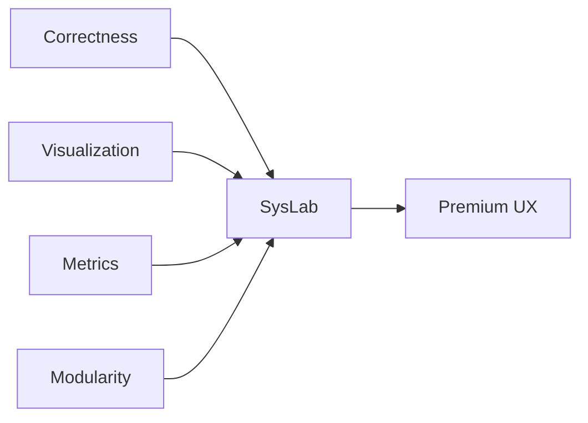

<div align="center">

# 🚀 SysLab

### *From Scheduling to Storage: Systems, Explained*

[](https://www.typescriptlang.org/)
[](https://reactjs.org/)
[](https://tailwindcss.com/)
[](https://vitejs.dev/)
[](https://www.framer.com/motion/)

**An interactive, premium systems engineering laboratory featuring advanced visualizations and real-time simulations**

[🎯 Live Demo](#) • [📚 Documentation](#features) • [🚀 Quick Start](#-quick-start) • [💡 Features](#-features)

---

</div>

## ✨ What is SysLab?

SysLab is a **cutting-edge web application** that brings computer science systems to life through interactive visualizations and real-time simulations. Built with modern web technologies and premium UI/UX design, it transforms complex theoretical concepts into engaging, hands-on learning experiences.

<div align="center">

### 🎨 **Premium Features**

| Feature | Description |
|---------|-------------|
| 🎯 **Interactive 3D Background** | Hover-responsive grid with vibrant color transitions |
| 💎 **Glassmorphism UI** | Modern, translucent design with backdrop blur effects |
| ⚡ **Real-time Simulations** | Live algorithm execution with step-by-step visualization |
| 🎨 **Premium Aesthetics** | Neon gradients, smooth animations, and glowing effects |
| 📊 **Advanced Metrics** | Comprehensive performance analytics and export capabilities |

</div>

---

## 🎯 Features

<table>
<tr>
<td width="50%">

### 🖥️ **CPU Scheduling & Process Control**

Visualize how operating systems manage processes with **6 scheduling algorithms**:

- ✅ FCFS (First Come First Served)
- ✅ SJF Non-Preemptive
- ✅ SJF Preemptive  
- ✅ Round Robin
- ✅ Priority Non-Preemptive
- ✅ Priority Preemptive

**Features:**
- 📊 Interactive Gantt chart timeline
- 🔄 Real-time process state tracking
- 📈 Performance metrics (waiting time, turnaround, CPU utilization)
- ⚡ Context switch visualization

</td>
<td width="50%">

### 💾 **Memory Management & Page Replacement**

Explore memory management with **3 page replacement algorithms**:

- ✅ FIFO (First In First Out)
- ✅ LRU (Least Recently Used)
- ✅ Optimal

**Features:**
- 🎬 Frame-by-frame animation
- 📊 Page hit/fault indicators
- 🔍 Eviction reasoning per step
- ⏯️ Step-by-step playback controls

</td>
</tr>
<tr>
<td width="50%">

### 🌐 **Network Protocol & Packet Flow**

Simulate TCP-like network behavior with:

- ✅ 3-way handshake (SYN, SYN-ACK, ACK)
- ✅ Reliable data transfer
- ✅ Packet loss simulation
- ✅ Retransmission logic
- ✅ Congestion control

**Features:**
- 📡 Animated packet flow
- 🔄 Sequence number tracking
- 📊 Congestion window evolution
- ⚠️ Configurable packet loss rate

</td>
<td width="50%">

### 🔧 **Compiler Playground**

Build and execute code with a **4-phase compiler**:

- ✅ Lexical Analysis (Tokenization)
- ✅ Syntax Parsing (AST Generation)
- ✅ Semantic Validation
- ✅ Interpreter Execution

**Features:**
- 📝 Live code editor
- 🌳 AST visualization
- 🔍 Step-by-step execution trace
- 🐛 Comprehensive error reporting

</td>
</tr>
<tr>
<td colspan="2">

### 🗄️ **Database Engine Internals**

Peek inside database operations with:

- ✅ B-Tree index visualization
- ✅ Query execution planning
- ✅ Index hit/miss tracking
- ✅ Disk I/O simulation

**Features:**
- 🌲 Interactive B-Tree structure
- 📊 Query performance metrics
- 🔍 SELECT and PROJECT operations
- ⚡ Index optimization analysis

</td>
</tr>
</table>

---

## 🚀 Quick Start

### Prerequisites

```bash
Node.js 18+ and npm
```

### Installation

```bash
# Clone the repository
git clone https://github.com/Ram6023/Syslab.git

# Navigate to project directory
cd Syslab

# Install dependencies
npm install

# Start development server
npm run dev
```

### Build for Production

```bash
# Create optimized production build
npm run build

# Preview production build
npm run preview
```

---

## 🎨 Technology Stack

<div align="center">

| Category | Technologies |
|----------|-------------|
| **Frontend** | React 18, TypeScript |
| **Styling** | Tailwind CSS, Custom CSS Variables |
| **UI Components** | shadcn/ui (Radix UI primitives) |
| **Animations** | Framer Motion |
| **Build Tool** | Vite |
| **Icons** | Lucide React |
| **State Management** | React Hooks |

</div>

---

## 📁 Project Structure

```
SysLab/
├── 📂 src/
│   ├── 📂 components/
│   │   ├── 📂 modules/           # Core simulation modules
│   │   │   ├── CPUScheduler/
│   │   │   ├── MemoryManager/
│   │   │   ├── NetworkSimulator/
│   │   │   ├── CompilerPlayground/
│   │   │   └── DatabaseEngine/
│   │   ├── 📂 shared/            # Shared components
│   │   ├── 📂 ui/                # UI primitives (shadcn/ui)
│   │   └── 📂 demos/             # Demo components
│   ├── 📂 core/                  # Core utilities
│   │   ├── simulation-engine.ts
│   │   ├── metrics-engine.ts
│   │   └── types.ts
│   ├── 📂 utils/                 # Algorithm implementations
│   ├── App.tsx                   # Main application
│   ├── main.tsx                  # Entry point
│   └── index.css                 # Global styles
├── 📂 public/                    # Static assets
├── 📂 docs/                      # Documentation
└── 📄 Configuration files
```

---

## 🎯 Design Philosophy

<div align="center">



</div>

### Core Principles

1. **🎯 Correctness First** - Algorithms are deterministic and handle all edge cases
2. **👁️ Visual Excellence** - Every algorithm is observable with step-by-step execution
3. **📊 Data-Driven** - Comprehensive metrics collection for analysis
4. **🧩 Modular Design** - Easy to extend with new tools and modules
5. **💎 Premium Aesthetics** - Modern UI with glassmorphism and smooth animations

---

## 🎨 UI/UX Highlights

### Premium Visual Elements

- **🌌 Interactive 3D Grid Background** - Hover-responsive boxes with vibrant color transitions
- **💎 Glassmorphism Effects** - Translucent cards with backdrop blur
- **✨ Neon Gradients** - Vibrant color schemes with glow effects
- **🎭 Smooth Animations** - Framer Motion powered transitions
- **🎯 Custom Cursor** - Interactive cursor with hover states
- **📱 Responsive Design** - Optimized for desktop and tablet

### Color Palette

```css
Primary (Neon Green):   hsl(142, 76%, 45%)
Accent (Electric Cyan): hsl(189, 94%, 55%)
Background (Deep Dark): hsl(222, 47%, 4%)
```

---

## 📊 Metrics & Analytics

All modules support comprehensive metrics collection:

- **Real-time Performance Metrics** - Live updates during simulation
- **JSON Export** - Download metrics for external analysis
- **Category-based Organization** - Performance, efficiency, utilization, errors
- **Visual Dashboards** - Interactive charts and graphs

---

## 🔬 Algorithm Details

### CPU Scheduling
- Handles idle time, context switches, and preemption
- Time quantum enforcement for Round Robin
- Deterministic execution with edge case handling

### Memory Management
- Frame occupancy state tracking
- LRU timestamp management
- Optimal algorithm with future reference prediction

### Network Simulation
- TCP-like state machine implementation
- Sequence number and ACK management
- Congestion control (slow start, congestion avoidance)

### Compiler
- Three-phase compilation pipeline
- AST generation and interpretation
- Step-by-step execution tracing

### Database Engine
- B-Tree index implementation
- Cost-based query planning
- Access pattern visualization

---

## 🚀 Future Enhancements

<details>
<summary>Click to expand roadmap</summary>

### Planned Features

- [ ] More scheduling algorithms (Multilevel Queue, MLFQ)
- [ ] Additional page replacement (Clock, Second Chance)
- [ ] UDP and HTTP protocol simulations
- [ ] Extended compiler features (functions, loops, conditionals)
- [ ] Advanced database operations (JOIN, GROUP BY, aggregation)
- [ ] Export visualizations as images/videos
- [ ] Side-by-side algorithm comparison mode
- [ ] Dark/Light theme toggle
- [ ] Mobile responsive optimizations

</details>

---

## 🤝 Contributing

Contributions are welcome! Please feel free to submit a Pull Request.

1. Fork the repository
2. Create your feature branch (`git checkout -b feature/AmazingFeature`)
3. Commit your changes (`git commit -m 'Add some AmazingFeature'`)
4. Push to the branch (`git push origin feature/AmazingFeature`)
5. Open a Pull Request

---

## 📝 License

This project is open source and available for educational and research purposes.

---

## 🙏 Acknowledgments

Built with ❤️ as a comprehensive systems engineering educational tool, emphasizing:
- **Correctness** over shortcuts
- **Visualization** over abstraction  
- **Understanding** over memorization

---

<div align="center">

### 🌟 Star this repository if you find it helpful!

**SysLab** — *From Scheduling to Storage: Systems, Explained*

Made with 💚 using React, TypeScript, and Tailwind CSS

[⬆ Back to Top](#-syslab)

</div>
